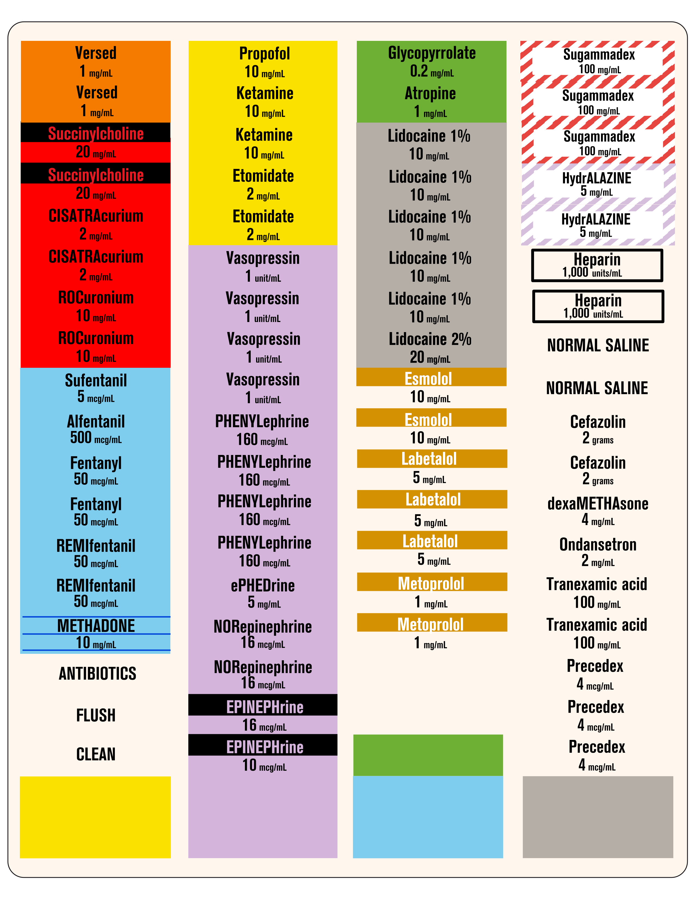

# anesthesia-labels
printable labels for syringes in operating room

- available above for Avery 5267 and Avery 60518
- see ASA's [Statement on Labeling of Pharmaceuticals for Use in Anesthesiology](https://web.archive.org/web/20240101145247/https://www.asahq.org/standards-and-practice-parameters/statement-on-labeling-of-pharmaceuticals-for-use-in-anesthesiology)
- and the UK association [statement](https://anaesthetists.org/Home/Resources-publications/Anaesthesia-News-magazine/Anaesthesia-News-Digital-February-2021/Standardisation-syringe-labelling-and-prefilled-syringes)